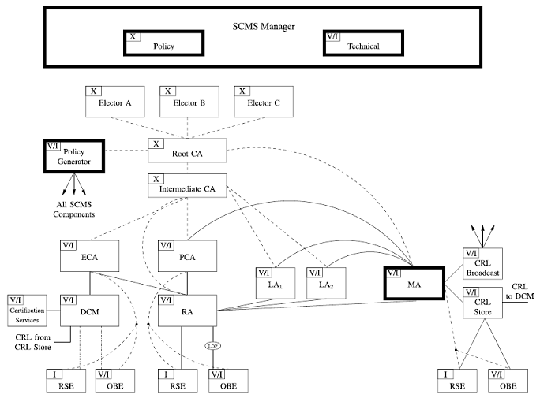
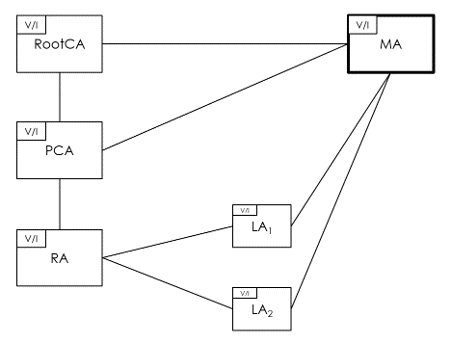

# Verifying a Protocol using Proverif: “A Security Credential Management System for V2X Communications”
### by Filippo Maria Cardano s292113

## Purpose of Report
To provide an overview of the code and the assumptions that were employed in the development of the Proverif model for the protocol proposed in the paper "A Security Credential Management System for V2X Communications". 
<br>
Source: https://ieeexplore.ieee.org/document/8309336

## The Protocol
The protocol is a Security Credential Management System (SCMS) developed to be a large and scalable Public Key Infrastructures (PKI) for vehicles. The SCMS is designed to enhance the cybersecurity and privacy of vehicle-to-everything (V2X) communications. It issues digital certificates to vehicles and infrastructure devices to enable secure and trustworthy communication, primarily for safety and mobility applications relying on V2X communications. The SCMS supports various use cases, including bootstrapping, certificate provisioning, misbehavior reporting, and revocation, with a focus on balancing security and privacy. To protect privacy, pseudonym certificates are issued to vehicles, and certificate generation and provisioning are decentralized among multiple organizations. The protocol aims to efficiently handle the revocation of misbehaving vehicles while safeguarding privacy. This SCMS protocol is crucial for establishing a nationwide Public Key Infrastructure for V2X security.

Key words:
- Vehicle-to-everything (V2X) communications
- Security Credential Management System (SCMS)
- Public Key Infrastructure (PKI)
- Pseudonym certificates
- Use cases
    - bootstrapping
    - certificate provisioning
    - misbehavior reporting
    - revocation

### The Component


*SCMS architecture overview.*

- SCMS Manager: Oversees the SCMS, sets rules and policies, and ensures fairness in reviewing misbehavior and revocation requests.
- Certification Services: Defines the certification process and which devices can receive digital certificates.
- CRL Store: Stores and shares Certificate Revocation Lists (CRLs) with SCMS components.
- CRL Broadcast: Broadcasts current CRLs through various channels.
- Device: A device in the SCMS network, like an OBE or RSE.
- Device Configuration Manager (DCM): Verifies a device's eligibility for enrollment certificates and provides necessary settings during setup.
- Electors: Trusted entities that endorse or revoke other key entities in the SCMS. They establish trust relationships.
- Enrollment CA (ECA): Issues enrollment certificates for device authentication, with variations for different regions or types.
- Intermediate CA (ICA): Protects the root CA from traffic and attacks, issued by the Root CA.
- Linkage Authority (LA): Generates values for efficient certificate revocation and splits this task to prevent tracking.
- Location Obscurer Proxy (LOP): Hides device locations by altering source addresses.
- Misbehavior Authority (MA): Processes misbehavior reports, revokes certificates, and maintains a blacklist.
- Policy Generator (PG): Manages global configuration and trust chain information.
- Pseudonym CA (PCA): Issues short-term certificates for device identification, with specialization options.
- Registration Authority (RA): Validates device requests, ensures revoked devices don't get new certificates, and manages SCMS configuration updates.
- Root Certificate Authority (RCA): The highest trust anchor in SCMS, issuing certificates for ICAs and key components, with critical security implications.

## The Assumptions

#### Removed / Altered Components:
- Electors: Eliminated because unnecessary for protocol bootstrapping, provisioning, and revocation.
- Policy Generator: Removed as it's unnecessary for protocol bootstrapping, provisioning, and revocation.
- Intermediate CAs: Excluded due to their role as territorial CAs that "shield" the Root CA from attacks, which is considered an unnecessary abstraction.
- Enrollment CA (ECA): Simplified version retained for bootstrapping purposes.
- Device Configuration Manager (DCM): Simplified version retained for bootstrapping but reduced in complexity.
- Road-Side Equipment (RSE): Removed as it's unnecessary for security properties and assumed to behave like a vehicle (OBE).
- CRL Components: Simplified and not detailed as they were not a focus of the verification.

#### Reasons for Removal / Altering:
- Root CA Hierarchy: A hierarchical structure with Root CA and intermediate CAs simplifies the model without affecting security properties.
- Certification Services: These were retained for specifying the certification process and device eligibility without added complexity.
- Device Configuration Manager: Simplified and retained for bootstrapping, eliminating redundant private channels.
- Enrollment CA (ECA): Necessary for bootstrapping but simplified to streamline the model.
- DCM Exclusion: DCM communication with ECA was considered secure, and its removal reduced complexity.


*The SCMS architecture after all assumptions.*

#### Simplifications
- Butterfly Key Expansion: works as intended and described by the protocol. However, the vehicle when requesting a Pseudonym Certificate will only receive one certificate, instead of the many (unspecified number) as suggested by the protocol.
- CRL: Is not a specific process, and there is no specific request/response structure to access the CRLs. It is simply represented as a table that only trustworthy parties can write and read.
- PCA (Pseudonym CA): Issues short-term pseudonym certificates.
- Certificate period of validity is not checked.
- The vehicle (OBE) receives keys from various entities out of band.
- The vehicle (OBE) bootstrapping phase is done in a secure out of band environment.

## The Code

Here is where I highlight some of the specific areas of the Proverif code where the assumptions are relevant and were used.


### Enrollment CA Simplification

Here we can see where the ECA simplification was used. The ECA is not a process in Proverif just a valid certificate signed by the RootCA, such that it can sign vehicle (OBE) Enrollment Certificates. The general use of the ECA is still in the protocol but there is no unnecessary complexity and message structure needed.

```
line 256-316 in script

....
(* RootCA Creation *)
....
	
	(* ECA Creation *)
	new eca_keymat:keymat;
	new eca_id:bitstring;
	let eca_pri_key = gen_pri_key(eca_keymat) in
	let eca_pub_key = gen_pub_key(eca_keymat) in
	let eca_cert = make_cert(eca_id, eca_pub_key, rootca_pri_key) in
	out(pub_ch, eca_cert);

....
(* Other CAs Creation *)
....

    (* OBE Enrollment Certificate Creation *)
    !(
        new obe_id:bitstring;
        new obe_keymat:keymat;
        let obe_pub_key = gen_pub_key(obe_keymat) in
        let obe_enrollment_cert = make_cert(obe_id, obe_pub_key, eca_pri_key) in
        out(pub_ch, obe_enrollment_cert);
        !(OBERequestPseudonym(obe_id, obe_keymat, obe_enrollment_cert, rootca_cert, eca_cert, ra_cert, pca_cert))
    )

```

### Certificate Period of Validity

Here we can see where the certificate period of validity is not checked. All processes and components have a certificate check, the example shown is in the RA. Here we can see that the RA receives a request from the vehicle (OBE), it unpacks the request, checks the CRL record, and furthermore checks the OBE signature. But what is not part of the procedure is a way of adding and checking the validity of a certificate over time.

```
line 168-189 in script

	in(pub_ch, encrypted_signed_request_from_obe:bitstring);

	(* Unpack Encrypted Request  *)
	let ra_pri_key = gen_pri_key(ra_keymat) in
	let signed_request_from_obe = adec(encrypted_signed_request_from_obe, ra_pri_key) in
	let (obe_enrollment_cert:cert, butterfly_A:bitstring, butterfly_H:bitstring, fk:bitstring, fe:bitstring) = get_message_sign(signed_request_from_obe) in
	
	(* Check Certificate  *)
	let eca_pub_key = get_cert_pub_key(eca_cert) in
	if check_cert(obe_enrollment_cert, eca_pub_key)=ok() then

	(* Check CRL  *)
	let cert_id = get_cert_id(obe_enrollment_cert) in
	get crl(=cert_id) in
	event Message_Discarded_Revoked_Certificate(cert_id); 0
	else

	(* Check OBE Signature *)
	let obe_pub_key = get_cert_pub_key(obe_enrollment_cert) in
	if check_sign(signed_request_from_obe, obe_pub_key)=ok() then

	event Received_Valid_Pseudonym_Request_RA(signed_request_from_obe);

```

### CRL Simplification

Here we can see where the CRL simplification takes place in the code. All processes and components have a certificate check, the example shown is in the OBEReceiveMessage, which is a process that accepts messages sent from OBEs. Here we can see that the OBEReceiveMessage receives a message, when it is time to access the CRL it just uses a private table that the attacker doesn't have access to. This is a simplification of the CRL access process, but there is no clear solution suggested by the paper.

```
line 105-122 in script

let OBEReceiveMessage(pca_cert:cert) = 
	in(pub_ch, full_message:bitstring);
	let (signed_message:bitstring, pseudonym_cert:cert) = full_message in

	(* Check pseudonym certificate  *)
	let pca_pub_key = get_cert_pub_key(pca_cert) in
	if check_cert(pseudonym_cert, pca_pub_key) = ok() then

	(* Check CRL  *)
	let cert_id = get_cert_id(pseudonym_cert) in
	get crl(=cert_id) in 
	event Message_Discarded_Revoked_Certificate(cert_id); 0
	else

	(* Check message signature  *)
	let pseudonym_pub_key = get_cert_pub_key(pseudonym_cert) in
	if but_check_sign(signed_message, pseudonym_pub_key) = ok() then
	event Received_Valid_Message(full_message).

```

## The Security Properties Tested

- Authentication
    - The authentication property is  essential to ensure that the entities involved in the communication process are able to authenticate each other securely and reliably. 
    - In Proverif using Correspondence assertions
- Secrecy
    - Secrecy is the property of information being protected from disclosure to unauthorized parties. In this particular case, states that the attacker can not obtain the long-term key of the vehicle.
    - In the protocol, all messages are sent it cleartext, and signed so only key materials should be kept secret
    - In Proverif using “free [private]”
- Anonymity
    - The adversary cannot distinguish whether the message has been signed with a valid pseudonym or a fake one. When a pseudonym certificate is requested, a vehicle can make n requests to the RA and an adversary and other entities are unable to associate a pseudonym certificate with the real identity of the vehicle.
    -In Proverif using “choice”
- Unlinkability
    - The vehicle has many pseudonymous certificates that need to be changed regularly. The vehicles is sending messages, and it should not be linked by these messages.
    -NOTE: As long as the vehicle uses the same pseudonym certificate it is always traceable.
    - In Proverif using “equivalence”


